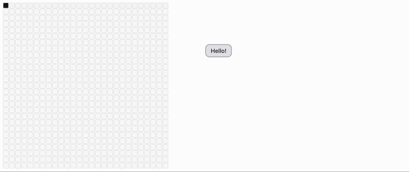

### Hi there 👋

    
  

My experience includes managing large-scale project backends, creating user-friendly Python libraries and REST APIs, handling network gateways for SaaS platforms, containerizing and packaging applications, developing robust document parsers and LLM apps like RAGs, and crafting quick demos with intuitive frontends and UX interactions.
I’m a firm believer in my mantra, `"If they can Do it, I can Do it."`   
If you want to know more about me, please visit my website and/or chat with my chatbot at [kc-bibek.com.np](https://kc-bibek.com.np).

[View Resume](https://kc-bibek.com.np/Bibek_CV.pdf)

<!-- <a href="https://github.com/bibekyess"></a> -->

<!-- 👨 **Profile Stat**
    

 -->
🐍 **Snake eating my contribution graph**

  

